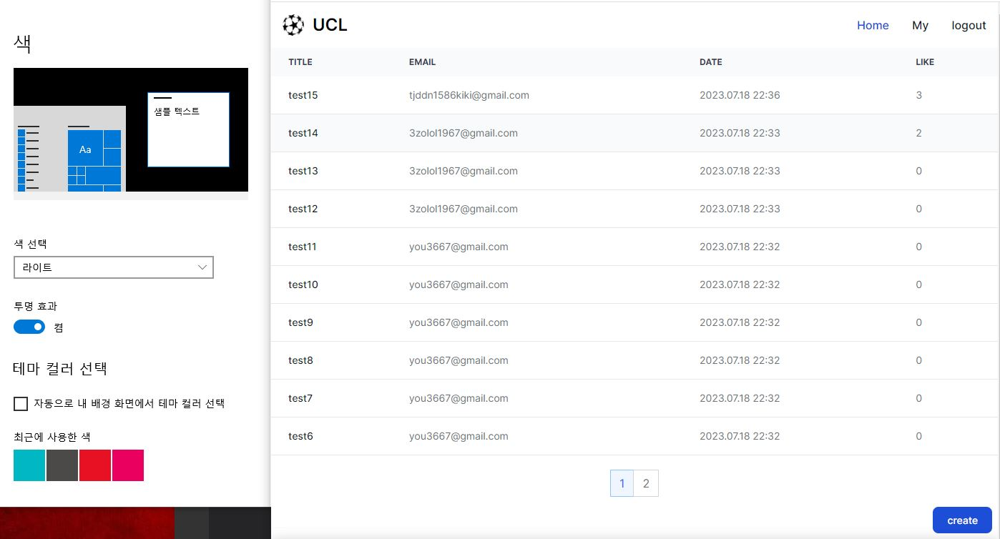

Simple CRUD boilerplate

Google login and CRUD(Boards, comments, replies and likes)
#

#
[Technologies Used]
1. next13
2. tailwindcss
3. react-query
4. prisma
5. mongodb
6. next-auth(google login)
#
[Setting .env]
1. DATABASE_URL: mongodb atlas url
2. GOOGLE_CLIENT_ID: google OAuth 2.0 client Id
3. GOOGLE_CLIENT_SECRET: google OAuth 2.0 client secret
4. NEXTAUTH_SECRET="NEXTAUTH_SECRET"
#
[About]
1. Support dark & light mode
2. Support pagination(boards)
3. Support mypage(view boards I wrote.)
4. Support Mobile ver(Responsive Web Design)